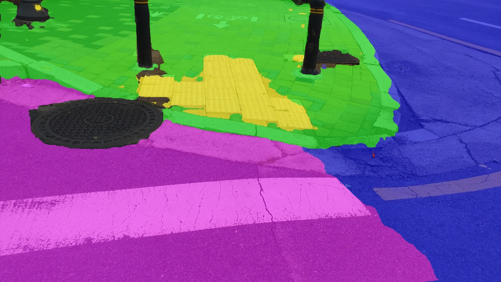
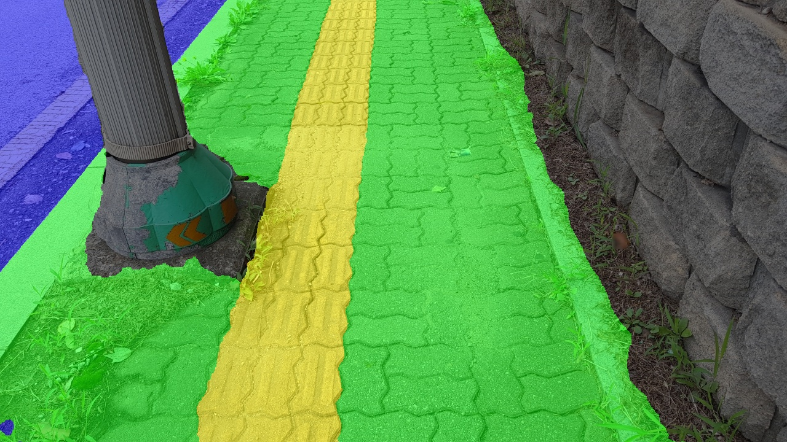
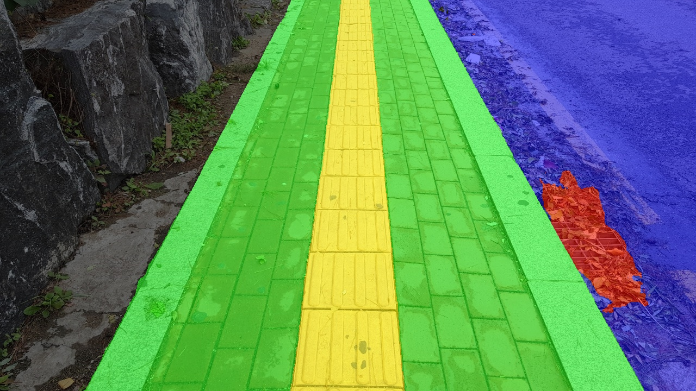
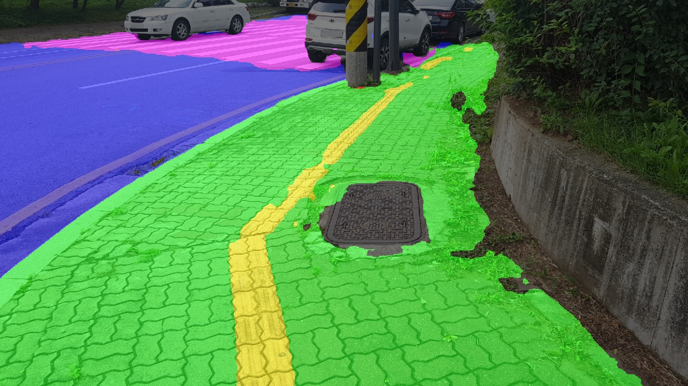
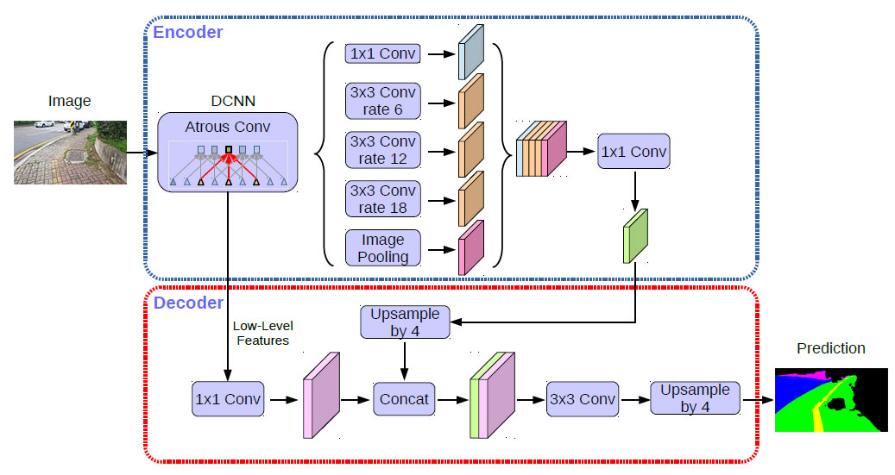
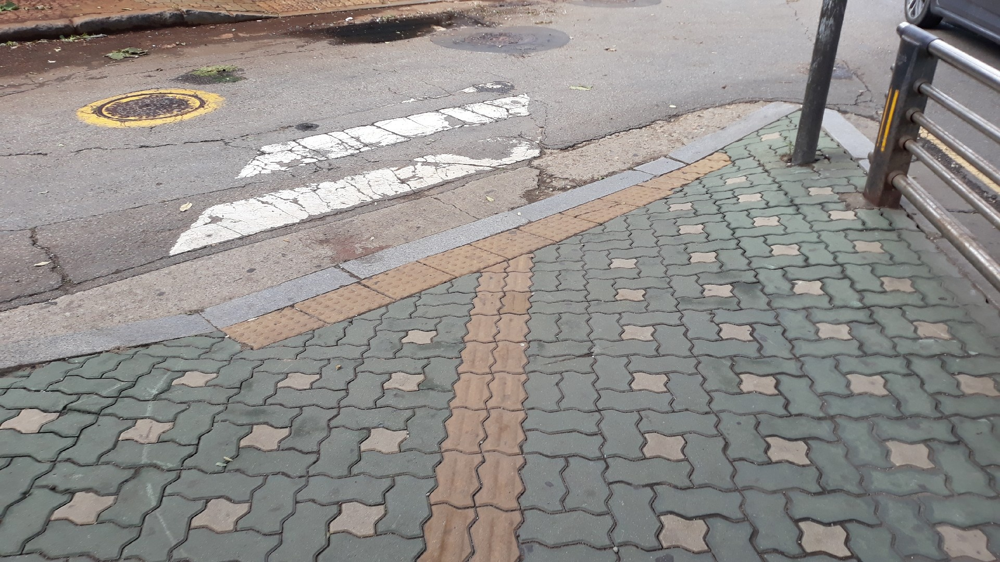
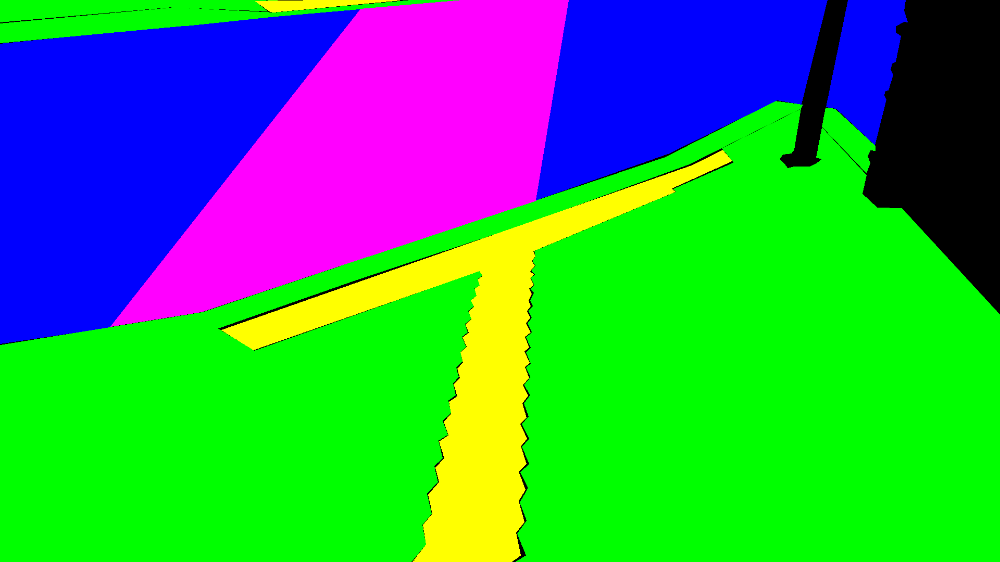
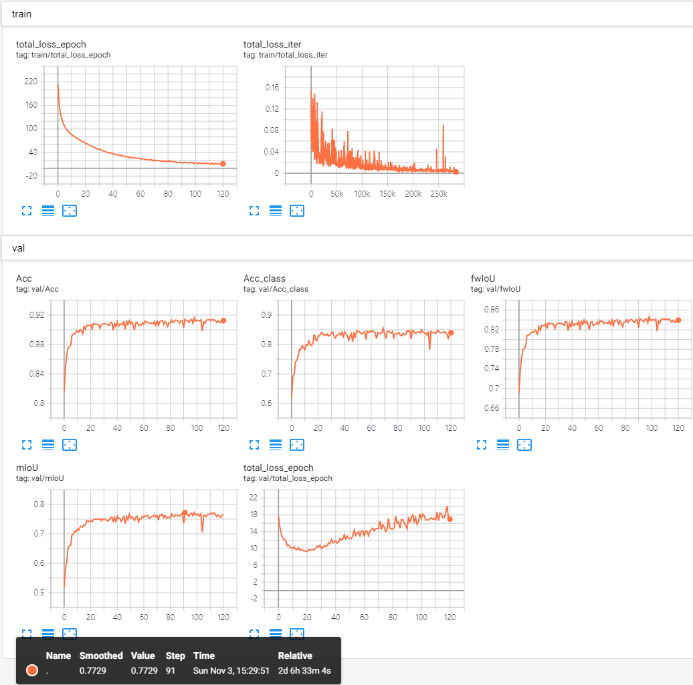

# segmentation-selectstar


# Introduction

This is a prototype model of **Pedestrian zone detection for blind people**.

Separates **sidewalk** and **driveway** areas using **Semantic Segmentation**.

Sample Results | -
--- | ---
 | 
 | 

Original repository: https://github.com/jfzhang95/pytorch-deeplab-xception

Modified to run NIA SurfaceMasking dataset by yoongi@selectstar.ai


# Model

### DeepLab v3+


[Paper] https://arxiv.org/abs/1802.02611


# Training Surface Masking Dataset

1. **Download NIA Surface Masking dataset from AIhub.** (Not yet published)

    The Original NIA Surface Masking dataset consists of the following classes:
    
    class@attribute | Meaning
    --- | ---
    alley@crosswalk|이면도로 - 횡단보도
    alley@damaged|이면도로 -파손
    alley@normal|이면도로 - 속성값 없음
    alley@speed_bump|이면도로 - 과속방지턱
    bike_lane|자전거도로
    braille_guide_blocks@damaged|점자블록 -파손
    braille_guide_blocks@normal|점자블록 -속성값 없음
    caution_zone@grating|주의구역 - 그레이팅
    caution_zone@manhole|주의구역 - 맨홀
    caution_zone@repair_zone|주의구역 - 보수구역
    caution_zone@stairs|주의구역 - 계단
    caution_zone@tree_zone|주의구역 - 가로수영역
    roadway@crosswalk|차도 - 횡단보도
    roadway@normal|차도 - 속성값없음
    sidewalk@asphalt|인도 - 아스팔트
    sidewalk@blocks|인도 - 보도블럭
    sidewalk@cement|인도 - 시멘트
    sidewalk@damaged|인도 - 파손
    sidewalk@other|인도 - 기타
    sidewalk@soil_stone|인도 - 흙,돌,비포장
    sidewalk@urethane|인도 - 우레탄
    
    **But there are too many classes to do segmentation, so I reduced into 6 classes:**
    
    New Class | Label | RGB Color
    --- | --- | ---
    background|0|[0, 0, 0]
    bike_lane|1|[255, 128, 0]
    caution_zone|2|[255, 0, 0]
    crosswalk|3|[255, 0, 255]
    guide_block|4|[255, 255, 0]
    roadway|5|[0, 0, 255]
    sidewalk|6|[0, 255, 0]
    
    **Check ```settings.py``` for detailed classes info.**


2. **Generate mask images by running:**
    1. ```modules/utils/surface_dataset_tools/surface_polygon.py```
    2. ```modules/utils/surface_dataset_tools/split_dataset.py```
    
    image | mask
    --- | ---
    |
    
3. **Dataset structure should be like this.**
    ```
    surface6
    ├── annotations
    │   ├── *.xml
    ├── images
    │   ├── *.jpg
    ├── masks
    │   ├── *.png
    ├── train.txt
    └── valid.txt
    ```
4. **Install python packages**
    ```
    Install Anaconda3 [https://www.anaconda.com/distribution/]
    conda create ml
    conda activate ml
    conda install conda
    conda install pytorch torchvision cudatoolkit=10.1 -c pytorch
    pip install tensorboardx, matplotlib
    ```
5. **Edit training options ```settings.py```**
    ```
    Designate dataset directory
    ...
    elif dataset == 'surface':
        root_dir = '/home/super/Projects/dataset/surface6'
    ...
    ```
6. **Run ```train.py```**
    1. On Windows: ```python train.py```
    2. On Linux: ```python3 train.py```
    3. On multi-gpu: ```CUDA_VISIBLE_DEVICES=0,1,2,3 python3 train.py```


# Download Trained Weights
[Model Weights](https://drive.google.com/file/d/1Y8RhV3hWEoE4mqbriGbAyMDQMIaQdrnb/view?usp=sharing)

Download and put it into ```./run/surface/deeplab/model_iou_77.pth.tar```

(Just create directory or Edit settings.py -> checkpoint, predict.py -> MODEL_PATH)

[Settings for Reproduction](https://drive.google.com/drive/folders/16Pu_N7TOJN6NA9d92ohREWsVy9cWRH1i?usp=sharing)


Trained on TitanXP x 4


# Predict
1. Prepare 'mp4 video' or 'jpg images' to predict. And put it into 'test' directory.
2. Prepare trained model like ```model_iou_77.pth.tar```
2. Edit ```RUN OPTIONS``` on predict.py
    ```
    MODEL_PATH, MODE, DATA_PATH, OUTPUT_PATH
    ```
3. Run ```predict.py```
4. Output result will be saved to OUTPUT_PATH


# Evaluate
1. Prepare dataset and trained model file.
2. Check settings.py options.
3. Run evaluate.py

### Performance

Result of 2000 random selected validation set.

(fwIoU: Frequency Weighted Intersection over Union)

Acc | Acc_class | mIoU | fwIoU
--- | --- | --- | ---
91.46% | 84.74% | 77.29% | 84.34%

IoU of each class

Class | IoU
--- | ---
background|85.40%
bike_lane|64.78%
caution_zone|57.19%
crosswalk|80.21%
guide_block|81.34%
roadway|85.69%
sidewalk|86.45%
